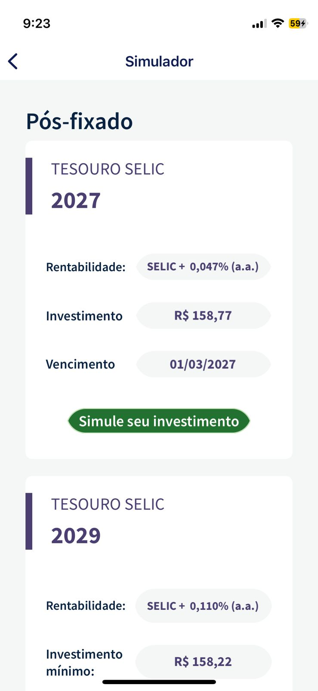
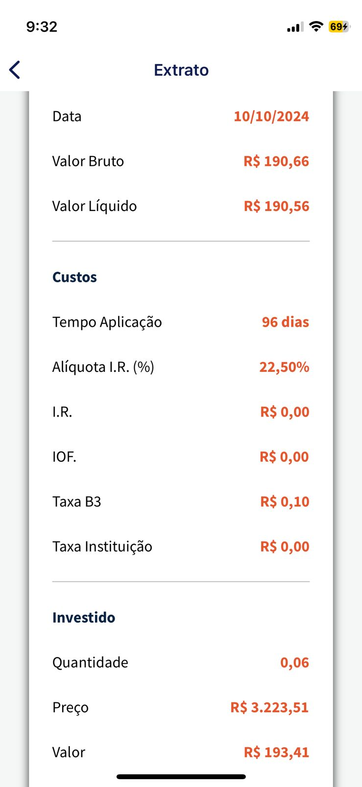
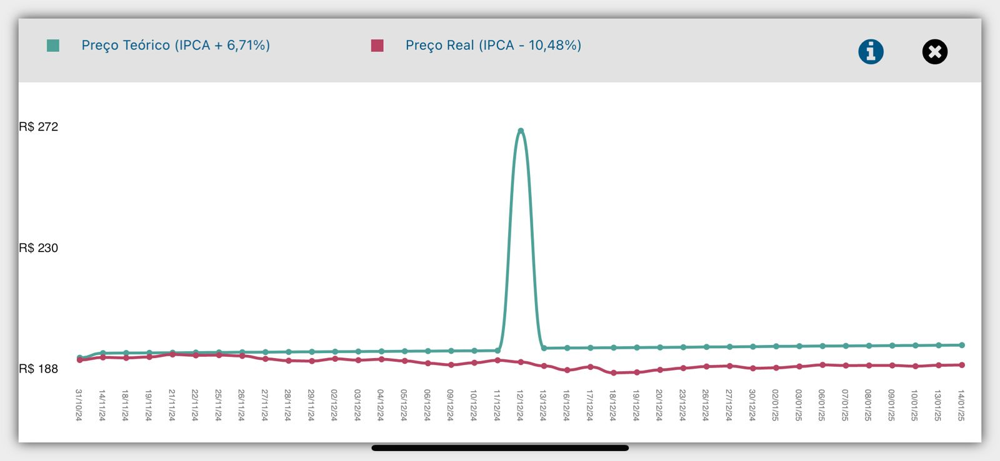

# Forward From 

## Introdução

Este documento explora o método de rastreabilidade forward-from, essencial no desenvolvimento de sistemas. A rastreabilidade de requisitos conecta e monitora requisitos durante todo o ciclo de vida do sistema, facilitando a garantia da qualidade, a gestão de mudanças e o alinhamento com as demandas do cliente. O método forward-from enfatiza a criação de vínculos claros entre os requisitos, os desenhos do sistema e sua implementação.

## Metodologia

A metodologia adotada foi uma matriz de rastreabilidade com referências cruzadas, aplicada aos requisitos elicitados e aos artefatos gerados nas etapas de desenvolvimento do projeto. Como a relação entre requisitos e artefatos não é única, na matriz as linhas representam os requisitos, enquanto as colunas correspondem aos artefatos gerados.

Na aplicação do método forward-from, é utilizado o meta-modelo proposto por Toranzo, que organiza os requisitos identificados em diferentes níveis e elos. De acordo com o slide número 19 da <a id="REF1" href="#anchor_1">aula 26</a> da disciplina requisitos de software, ministrada pela professora Milene Serrano, os níveis são definidos da seguinte forma:

- **_Ambiental_**: Abrange informações derivadas do ambiente e contexto em que a organização opera.
- **_Organizacional_**: Refere-se a dados relacionados à estrutura e funcionamento da organização.
- **_Gerencial_**: Inclui informações que apoiam a gestão eficiente do projeto.
- **_Desenvolvimento_**: Envolve os dados associados aos artefatos gerados durante o processo de desenvolvimento.

Conforme descrito no slide número 21 da <a id="REF1" href="#anchor_1">aula 26</a>, os principais **elos de rastreabilidade** identificados são:

1. **Satisfação**: Representa a relação em que a classe de origem depende da satisfação proporcionada pela classe de destino.
2. **Recurso**: Define a dependência da classe de origem em relação aos recursos da classe de destino.
3. **Responsabilidade**: Documenta as ações, responsabilidades e participações de indivíduos sobre os artefatos.
4. **Representação**: Descreve como os requisitos são expressos ou modelados em linguagens alternativas.
5. **Alocado**: Estabelece a ligação entre a classe de origem e uma classe de destino correspondente a um subsistema.
6. **Agregação**: Representa a composição de elementos que constituem o sistema.

Para estruturar a criação do meta-modelo de Toranzo, foram desenvolvidas as **tabelas 1 e 2**.

## Matriz de Rastreabilidade 

A tabela 1 representa a matriz de rastreabilidade.

**Legenda:**

> - RF - Requisito Funcional
> - RNF - Requisito não Funcional
> - UC - Caso de Uso 
> - CEN - Cenários
> - F, U, C, S, P - Especificação Suplementar
> - L - Léxicos
> - NFR - NFR Framework
> - EC - Épico 
> - FT - Feature
> - HS - História de Usuário

<b>Tabela 1:</b> Matriz de rastreabilidade Foward-From

| Requisito e Versão | Tipo | Implementado | Caso de Uso | Cenários | Especificação Suplementar | Léxicos | NFR Framework | Épico | Feature | História de Usuário | Elo Relacionado |
| ------------------ | ---- | ------------ | ----------- | -------- | ------------------------- | ------- | ------------- | ----- | ------- | ------------------- | --------------- |
| <a href="../../elicitacao/grupo5/requisitos/#anchor_RF01">RF01<a/> / `1.4` | RF |  Sim  | <a href="../../modelagem-pt1/casos-de-uso"><a href="../../modelagem-pt1/casos-de-uso">UC06</a></a> | | | L01, L03, L04 | | EC01 | FT01, FT02 | US01 | ELOF01 |
| <a href="../../elicitacao/grupo5/requisitos/#anchor_RF02">RF02<a/> / `1.4` | RF |  Sim  | <a href="../../modelagem-pt1/casos-de-uso"><a href="../../modelagem-pt1/casos-de-uso">UC02</a></a> | <a href="../../modelagem-pt1/cenarios/">CEN01<a/> | | L02, L03, L05 | | EC03 | FT06 | US19 | ELOF02 |
| <a href="../../elicitacao/grupo5/requisitos/#anchor_RF03">RF03<a/> / `1.4` | RF |  Sim  | <a href="../../modelagem-pt1/casos-de-uso"><a href="../../modelagem-pt1/casos-de-uso">UC07</a></a> | <a href="../../modelagem-pt1/cenarios/">CEN02<a/> | | | | EC07 | FT14 | US03 | ELOF03 |
| <a href="../../elicitacao/grupo5/requisitos/#anchor_RF04">RF04<a/> / `1.4` | RF |  Sim  | <a href="../../modelagem-pt1/casos-de-uso"><a href="../../modelagem-pt1/casos-de-uso">UC08</a></a> | <a href="../../modelagem-pt1/cenarios/">CEN03<a/> | | | | EC09 | FT18 | US04 | ELOF04 |
| <a href="../../elicitacao/grupo5/requisitos/#anchor_RF05">RF05<a/> / `1.4` | RF |  Sim  | | <a href="../../modelagem-pt1/cenarios/">CEN04<a/> | | | | EC10 | FT20 | US05 | ELOF05 |
| <a href="../../elicitacao/grupo5/requisitos/#anchor_RF06">RF06<a/> / `1.4` | RF |  Sim  | | | | L02, L05 | | EC04 | FT07 | US06 | ELOF06 |
| <a href="../../elicitacao/grupo5/requisitos/#anchor_RF08">RF08<a/> / `1.4` | RF |  Sim  | | <a href="../../modelagem-pt1/cenarios/">CEN05<a/> | | L02, L05 | | EC07 | FT14 | US07 | ELOF08 | 
| <a href="../../elicitacao/grupo5/requisitos/#anchor_RF09">RF09<a/> / `1.4` | RF |  Sim  | | | | | | EC12 | FT25 | US08 | ELOF09 |
| <a href="../../elicitacao/grupo5/requisitos/#anchor_RF12">RF12<a/> / `1.4` | RF |  Sim  | | | | L02, L05 | | EC11 | FT23 | US09 | ELOF12 |
| <a href="../../elicitacao/grupo5/requisitos/#anchor_RF13">RF13<a/> / `1.4` | RF |  Não  | | | | L05 | | EC07, EC12 | FT15, FT26 | US10 | ELOF13 |
| <a href="../../elicitacao/grupo5/requisitos/#anchor_RF14">RF14<a/> / `1.4` | RF |  Não  | | | | L02, L05 | | EC02 | FT04 | US11 | ELOF14 |
| <a href="../../elicitacao/grupo5/requisitos/#anchor_RF15">RF15<a/> / `1.4` | RF |  Não  | <a href="../../modelagem-pt1/casos-de-uso"><a href="../../modelagem-pt1/casos-de-uso">UC10</a></a> | <a href="../../modelagem-pt1/cenarios/">CEN09<a/> | | L04 | | EC04 | FT07 | US12 | ELOF15 |
| <a href="../../elicitacao/grupo5/requisitos/#anchor_RF16">RF16<a/> / `1.4` | RF |  Não  | | | | | | EC08 | FT16 | US13 | ELOF16 |
| <a href="../../elicitacao/grupo5/requisitos/#anchor_RF17">RF17<a/> / `1.4` | RF |  Não  | | | | | | EC02 | FT04 | US14 | ELOF17 |
| <a href="../../elicitacao/grupo5/requisitos/#anchor_RF18">RF18<a/> / `1.4` | RF |  Não  | | | | L05 | | EC15 | FT31 | US15 | ELOF18 |
| <a href="../../elicitacao/grupo5/requisitos/#anchor_RF20">RF20<a/> / `1.4` | RF |  Não  | | | | | | EC05 | FT09 | US16 | ELOF20 |
| <a href="../../elicitacao/grupo5/requisitos/#anchor_RF21">RF21<a/> / `1.4` | RF |  Não  | | | | | | EC08 | FT17 | US17 | ELOF21 |
| <a href="../../elicitacao/grupo5/requisitos/#anchor_RF23">RF23<a/> / `1.4` | RF |  Não  | | <a href="../../modelagem-pt1/cenarios/">CEN07<a/> | | | | EC03 | FT05 | US18 | ELOF23 |
| <a href="../../elicitacao/grupo5/requisitos/#anchor_RF24">RF24<a/> / `1.4` | RF |  Sim  | | | | L03 | | EC03 | FT06 | US19 | ELOF24 |
| <a href="../../elicitacao/grupo5/requisitos/#anchor_RF25">RF25<a/> / `1.4` | RF |  Não  | <a href="../../modelagem-pt1/casos-de-uso"><a href="../../modelagem-pt1/casos-de-uso">UC09</a></a> | <a href="../../modelagem-pt1/cenarios/">CEN08<a/> | | L06 | | EC09 | FT19 | US20 | ELOF25 |
| <a href="../../elicitacao/grupo5/requisitos/#anchor_RF26">RF26<a/> / `1.4` | RF |  Não  | <a href="../../modelagem-pt1/casos-de-uso"><a href="../../modelagem-pt1/casos-de-uso">UC11</a></a> | <a href="../../modelagem-pt1/cenarios/">CEN26<a/> | | | | EC04 | FT08 | US21 | ELOF26 |
| <a href="../../elicitacao/grupo5/requisitos/#anchor_RF27">RF27<a/> / `1.4` | RF |  Não  | | | | | | EC09 | FT19 | US22 | ELOF27 |
| <a href="../../elicitacao/grupo5/requisitos/#anchor_RF28">RF28<a/> / `1.4` | RF |  Não  | | | | | | EC10 | FT21 | US23 | ELOF28 |
| <a href="../../elicitacao/grupo5/requisitos/#anchor_RF29">RF29<a/> / `1.4` | RF |  Não  | | | | | | EC05 | FT11 | US10 | ELOF29 |
| <a href="../../elicitacao/grupo5/requisitos/#anchor_RF31">RF31<a/> / `1.4` | RF |  Sim  | | | | | | EC07 | FT14 | US25 | ELOF31 |
| <a href="../../elicitacao/grupo5/requisitos/#anchor_RF32">RF32<a/> / `1.4` | RF |  Sim  | | | | | | EC04 | FT07 | US26 | ELOF32 |
| <a href="../../elicitacao/grupo5/requisitos/#anchor_RF33">RF33<a/> / `1.4` | RF |  Não  | <a href="../../modelagem-pt1/casos-de-uso"><a href="../../modelagem-pt1/casos-de-uso">UC01</a></a> | | | | | EC05 | FT09 | US27 | ELOF33 |
| <a href="../../elicitacao/grupo5/requisitos/#anchor_RF34">RF34<a/> / `1.4` | RF |  Sim  | <a href="../../modelagem-pt1/casos-de-uso"><a href="../../modelagem-pt1/casos-de-uso">UC01</a></a> | | | L05 | | EC05 | FT09 | US28 | ELOF34 |
| <a href="../../elicitacao/grupo5/requisitos/#anchor_RF35">RF35<a/> / `1.4` | RF |  Sim  | <a href="../../modelagem-pt1/casos-de-uso"><a href="../../modelagem-pt1/casos-de-uso">UC03</a></a> | | | | | EC02 | FT03  | US29  | ELOF35 |
| <a href="../../elicitacao/grupo5/requisitos/#anchor_RF36">RF36<a/> / `1.4` | RF |  Sim  | | | | | | EC01, EC15 | FT01, FT32 | US15 | ELOF36 |
| <a href="../../elicitacao/grupo5/requisitos/#anchor_RF37">RF37<a/> / `1.4` | RF |  Sim  | | | | | | EC03 | FT06 | US02, US33 | ELOF37 |
| <a href="../../elicitacao/grupo5/requisitos/#anchor_RF39">RF38<a/> / `1.4` | RF |  Sim  | | | | L01 | | EC03 | FT05 | US32 | ELOF38 |
| <a href="../../elicitacao/grupo5/requisitos/#anchor_RF39">RF39<a/> / `1.4` | RF |  Sim  | | | | L01 | | EC03 | FT05 | US31 | ELOF39 |
| <a href="../../elicitacao/grupo5/requisitos/#anchor_RF40">RF40<a/> / `1.4` | RF |  Não  | | | | | | EC09 | FT19 | US34 | ELOF40 |
| <a href="../../elicitacao/grupo5/requisitos/#anchor_RF41">RF41<a/> / `1.4` | RF |  Sim  | | | | | | EC05, EC11 | FT09, FT22 | US09 | ELOF41 |
| RNF01 / `1.4` | RNF | Não | | | P | | <a href="../../modelagem-pt2/nfr_framework">NFR02</a> | EC04, EC14 | FT07, FT30 | US38 | ELONF01 |
| RNF02 / `1.4` | RNF | Sim | | | C | | | EC06 | FT12 | US39 | ELONF02 |
| RNF03 / `1.4` | RNF | Sim | | | S | | NFR03 | EC06 | FT12 | US40 | ELONF03 |
| RNF04 / `1.4` | RNF | Não | | | U | | NFR01 | EC06, EC11, EC13 | FT13, FT24, FT28 | US41 | ELONF04 | 
| RNF05 / `1.4` | RNF | Sim | | | C | | | EC06 | FT12 | US39 | ELONF05 |
| RNF06 / `1.4` | RNF | Não | | | S | | | EC14 | FT29 | US38 | ELONF06 |
| RNF08 / `1.4` | RNF | Não | | | U | | <a href="../../modelagem-pt2/nfr_framework">NFR02</a> | EC11 | FT24 | US35 | ELONF08 |
| RNF09 / `1.4` | RNF | Não | | | U | | NFR01 | EC05, EC13 | FT10, FT27 | US36 | ELONF09 |
| RNF10 / `1.4` | RNF | Sim | | | C | | | EC06 | FT12 | US39 | ELONF10 |
| RNF11 / `1.4` | RNF | Sim | | | C | | | EC04 | FT07 | US06 | ELONF11 |

Autor: <a href="https://github.com/ViictorHugoo">Victor Hugo</a>, 2025

## Elos 

A tabela 2 mostra os elos entre os requisitos elicitados e os artefatos do projeto.

<b>Tabela 2:</b> Elos de rastreabilidade Forward-from

| Elo | Requisito | Satisfação | Recusrso | Representação | Alocado | Agregação |
| --- | --------- | ---------- | -------- | ------------- | ------- | --------- |
| ELOF01 | <a href="../../elicitacao/grupo5/requisitos/#anchor_RF01">RF01<a/> | US01 | <a href="../../modelagem-pt1/casos-de-uso">UC03</a> |  | <a href="../../modelagem-pt2/nfr_framework"><a href="../../modelagem-pt2/nfr_framework">NFR02</a></a> | <a href="../../elicitacao/grupo5/requisitos/#anchor_RF36">RF36<a/> |
| ELOF02 | <a href="../../elicitacao/grupo5/requisitos/#anchor_RF02">RF02<a/> | US02 | <a href="../../modelagem-pt1/casos-de-uso">UC02</a> |  | <a href="../../modelagem-pt2/nfr_framework"><a href="../../modelagem-pt2/nfr_framework">NFR02</a></a> | <a href="../../elicitacao/grupo5/requisitos/#anchor_RF37">37<a/>, <a href="../../elicitacao/grupo5/requisitos/#anchor_RF38">RF38<a/>, <a href="../../elicitacao/grupo5/requisitos/#anchor_RF39">RF39<a/> |
| ELOF03 | <a href="../../elicitacao/grupo5/requisitos/#anchor_RF03">RF03<a/> | US03 | <a href="../../modelagem-pt1/casos-de-uso">UC07</a> | | <a href="../../modelagem-pt2/nfr_framework">NFR03</a> | <a href="../../elicitacao/grupo5/requisitos/#anchor_RF26">RF26<a/>, <a href="../../elicitacao/grupo5/requisitos/#anchor_RF36>RF36<a/> |
| ELOF04 | <a href="../../elicitacao/grupo5/requisitos/#anchor_RF04">RF04<a/> | US04 | <a href="../../modelagem-pt1/casos-de-uso">UC08</a> |  | <a href="../../modelagem-pt2/nfr_framework">NFR02</a> | <a href="../../elicitacao/grupo5/requisitos/#anchor_RF25">RF25<a/>, <a href="../../elicitacao/grupo5/requisitos/#anchor_RF27">RF27<a/> |
| ELOF05 | <a href="../../elicitacao/grupo5/requisitos/#anchor_RF05">RF05<a/> | US05 | <a href="../../modelagem-pt1/casos-de-uso">UC02</a> |  | <a href="../../modelagem-pt2/nfr_framework">NFR03</a> | <a href="../../elicitacao/grupo5/requisitos/#anchor_RF28">RF28<a/> |
| ELOF06 | <a href="../../elicitacao/grupo5/requisitos/#anchor_RF06">RF06<a/> | US06 | <a href="../../modelagem-pt1/casos-de-uso">UC10</a> |  | <a href="../../modelagem-pt2/nfr_framework">NFR02</a> | <a href="../../elicitacao/grupo5/requisitos/#anchor_RF01">RF01<a/>, <a href="../../elicitacao/grupo5/requisitos/#anchor_RF03">RF03<a/> |
| ELOF08 | <a href="../../elicitacao/grupo5/requisitos/#anchor_RF08">RF08<a/> | US07 | <a href="../../modelagem-pt1/casos-de-uso">UC06</a> | | <a href="../../modelagem-pt2/nfr_framework">NFR02</a> | <a href="../../elicitacao/grupo5/requisitos/#anchor_RF01">RF01<a/>, <a href="../../elicitacao/grupo5/requisitos/#anchor_RF36">RF36<a/> |
| ELOF09 | <a href="../../elicitacao/grupo5/requisitos/#anchor_RF09">RF09<a/> | US08 | <a href="../../modelagem-pt1/casos-de-uso">UC08</a>, <a href="../../modelagem-pt1/casos-de-uso">UC09</a> |  | <a href="../../modelagem-pt2/nfr_framework">NFR01</a> | <a href="../../elicitacao/grupo5/requisitos/#anchor_RF21">RF21<a/> |
| ELOF12 | <a href="../../elicitacao/grupo5/requisitos/#anchor_RF12">RF12<a/> | US09 | <a href="../../modelagem-pt1/casos-de-uso">UC11</a> |  | <a href="../../modelagem-pt2/nfr_framework">NFR02</a> | <a href="../../elicitacao/grupo5/requisitos/#anchor_RF41">RF41<a/> |
| ELOF13 | <a href="../../elicitacao/grupo5/requisitos/#anchor_RF13">RF13<a/> | US10 | <a href="../../modelagem-pt1/casos-de-uso">UC08</a>, <a href="../../modelagem-pt1/casos-de-uso">UC10</a> | | <a href="../../elicitacao/grupo5/requisitos/#anchor_RF03">RF03<a/> | <a href="../../elicitacao/grupo5/requisitos/#anchor_RF04">RF04<a/>, <a href="../../elicitacao/grupo5/requisitos/#anchor_RF25">RF25<a/> |
| ELOF14 | <a href="../../elicitacao/grupo5/requisitos/#anchor_RF14">RF14<a/> | US11 | <a href="../../modelagem-pt1/casos-de-uso">UC06</a>, <a href="../../modelagem-pt1/casos-de-uso">UC10</a> | | RNF03 | <a href="../../elicitacao/grupo5/requisitos/#anchor_RF24">RF24<a/> |
| ELOF15 | <a href="../../elicitacao/grupo5/requisitos/#anchor_RF15">RF15<a/> | US12 | <a href="../../modelagem-pt1/casos-de-uso">UC10</a> |  | <a href="../../modelagem-pt2/nfr_framework">NFR03</a> | <a href="../../elicitacao/grupo5/requisitos/#anchor_RF10">RF10<a/>, <a href="../../elicitacao/grupo5/requisitos/#anchor_RF26">RF26<a/> |
| ELOF16 | <a href="../../elicitacao/grupo5/requisitos/#anchor_RF16">RF16<a/> | US13 | <a href="../../modelagem-pt1/casos-de-uso">UC02</a>, <a href="../../modelagem-pt1/casos-de-uso">UC08</a> | | <a href="../../modelagem-pt2/nfr_framework">NFR01</a> | <a href="../../elicitacao/grupo5/requisitos/#anchor_RF21">RF21<a/> |
| ELOF17 | <a href="../../elicitacao/grupo5/requisitos/#anchor_RF17">RF17<a/> | US14 | <a href="../../modelagem-pt1/casos-de-uso">UC01</a>, <a href="../../modelagem-pt1/casos-de-uso">UC03</a> | | <a href="../../modelagem-pt2/nfr_framework">NFR03</a> | <a href="../../elicitacao/grupo5/requisitos/#anchor_RF10">RF10<a/> |
| ELOF18 | <a href="../../elicitacao/grupo5/requisitos/#anchor_RF18">RF18<a/> | US15 | <a href="../../modelagem-pt1/casos-de-uso">UC11</a> | | <a href="../../modelagem-pt2/nfr_framework">NFR03</a> | <a href="../../elicitacao/grupo5/requisitos/#anchor_RF11">RF11<a/> |
| ELOF20 | <a href="../../elicitacao/grupo5/requisitos/#anchor_RF20">RF20<a/> | US16 | <a href="../../modelagem-pt1/casos-de-uso">UC01</a>, <a href="../../modelagem-pt1/casos-de-uso">UC06</a> | | <a href="../../modelagem-pt2/nfr_framework">NFR01</a> | <a href="../../elicitacao/grupo5/requisitos/#anchor_RF29">RF29<a/> |
| ELOF21 | <a href="../../elicitacao/grupo5/requisitos/#anchor_RF21">RF21<a/> | US17 | <a href="../../modelagem-pt1/casos-de-uso">UC09</a>, <a href="../../modelagem-pt1/casos-de-uso">UC11</a> | | <a href="../../modelagem-pt2/nfr_framework">NFR01</a> | RF16, RF09 |
| ELOF23 | <a href="../../elicitacao/grupo5/requisitos/#anchor_RF23">RF23<a/> | US18 | <a href="../../modelagem-pt1/casos-de-uso">UC02</a> | | <a href="../../modelagem-pt2/nfr_framework">NFR02</a> | RF02 |
| ELOF24 | <a href="../../elicitacao/grupo5/requisitos/#anchor_RF24">RF24<a/> | US19 | <a href="../../modelagem-pt1/casos-de-uso">UC02</a>, <a href="../../modelagem-pt1/casos-de-uso">UC06</a> | | <a href="../../modelagem-pt2/nfr_framework">NFR02</a> | RF02, RF26 |
| ELOF25 | <a href="../../elicitacao/grupo5/requisitos/#anchor_RF25">RF25<a/> | US20 | <a href="../../modelagem-pt1/casos-de-uso">UC09</a> | | <a href="../../modelagem-pt2/nfr_framework">NFR01</a> | RF04, RF27 |
| ELOF26 | <a href="../../elicitacao/grupo5/requisitos/#anchor_RF26">RF26<a/> | US21 | <a href="../../modelagem-pt1/casos-de-uso">UC11</a> |  | <a href="../../modelagem-pt2/nfr_framework">NFR03</a> | RF03, RF24 |
| ELOF27 | <a href="../../elicitacao/grupo5/requisitos/#anchor_RF27">RF27<a/> | US22 | <a href="../../modelagem-pt1/casos-de-uso">UC08</a> | | <a href="../../modelagem-pt2/nfr_framework">NFR01</a> | RF04, RF25 |
| ELOF28 | <a href="../../elicitacao/grupo5/requisitos/#anchor_RF28">RF28<a/> | US23 | <a href="../../modelagem-pt1/casos-de-uso">UC09</a>, <a href="../../modelagem-pt1/casos-de-uso">UC10</a> | | <a href="../../modelagem-pt2/nfr_framework">NFR03</a> | RF05 |
| ELOF29 | <a href="../../elicitacao/grupo5/requisitos/#anchor_RF29">RF29<a/> | US24 | <a href="../../modelagem-pt1/casos-de-uso">UC01</a>, <a href="../../modelagem-pt1/casos-de-uso">UC03</a> | | <a href="../../modelagem-pt2/nfr_framework">NFR03</a> | RRF20 |
| ELOF31 | <a href="../../elicitacao/grupo5/requisitos/#anchor_RF31">RF31<a/> | US25 | <a href="../../modelagem-pt1/casos-de-uso">UC02</a>, <a href="../../modelagem-pt1/casos-de-uso">UC06</a> |  | <a href="../../modelagem-pt2/nfr_framework">NFR03</a> | RF17 |
| ELOF32 | <a href="../../elicitacao/grupo5/requisitos/#anchor_RF32">RF32<a/> | US26 | <a href="../../modelagem-pt1/casos-de-uso">UC10</a>, <a href="../../modelagem-pt1/casos-de-uso">UC11</a> |  | <a href="../../modelagem-pt2/nfr_framework">NFR02</a> | RF26 |
| ELOF33 | <a href="../../elicitacao/grupo5/requisitos/#anchor_RF33">RF33<a/> | US27 | <a href="../../modelagem-pt1/casos-de-uso">UC01</a> | | <a href="../../modelagem-pt2/nfr_framework">NFR01</a> | RF34 |
| ELOF34 | <a href="../../elicitacao/grupo5/requisitos/#anchor_RF34">RF34<a/> | US28 | <a href="../../modelagem-pt1/casos-de-uso">UC01</a> |  | <a href="../../modelagem-pt2/nfr_framework">NFR01</a> | RF33 |
| ELOF35 | <a href="../../elicitacao/grupo5/requisitos/#anchor_RF35">RF35<a/> | US29 | <a href="../../modelagem-pt1/casos-de-uso">UC06</a>, <a href="../../modelagem-pt1/casos-de-uso">UC08</a> |  | <a href="../../modelagem-pt2/nfr_framework">NFR02</a> | RF02  |
| ELOF36 | <a href="../../elicitacao/grupo5/requisitos/#anchor_RF36">RF36<a/> | US30 | <a href="../../modelagem-pt1/casos-de-uso">UC06</a>, <a href="../../modelagem-pt1/casos-de-uso">UC10</a> | | <a href="../../modelagem-pt2/nfr_framework">NFR01</a> | RF01, RF03 |
| ELOF37 | <a href="../../elicitacao/grupo5/requisitos/#anchor_RF37">RF37<a/> | US31 | <a href="../../modelagem-pt1/casos-de-uso">UC02</a>, <a href="../../modelagem-pt1/casos-de-uso">UC19</a> | | <a href="../../modelagem-pt2/nfr_framework">NFR01</a> | RF02, RF24 |
| ELOF38 | <a href="../../elicitacao/grupo5/requisitos/#anchor_RF38">RF38<a/> | US32 | <a href="../../modelagem-pt1/casos-de-uso">UC02</a>, <a href="../../modelagem-pt1/casos-de-uso">UC08</a> | | <a href="../../modelagem-pt2/nfr_framework">NFR01</a> | RF02 |
| ELOF39 | <a href="../../elicitacao/grupo5/requisitos/#anchor_RF39">RF39<a/> | US33 | <a href="../../modelagem-pt1/casos-de-uso">UC09</a> | | <a href="../../modelagem-pt2/nfr_framework">NFR03</a> | RF02 |
| ELOF40 | <a href="../../elicitacao/grupo5/requisitos/#anchor_RF40">RF40<a/> | US34 | <a href="../../modelagem-pt1/casos-de-uso">UC08</a>, <a href="../../modelagem-pt1/casos-de-uso">UC09</a> | | <a href="../../modelagem-pt2/nfr_framework">NFR01</a> | RF04 |
| ELOF41 | <a href="../../elicitacao/grupo5/requisitos/#anchor_RF41">RF41<a/> | US35 | <a href="../../modelagem-pt1/casos-de-uso">UC01</a>, <a href="../../modelagem-pt1/casos-de-uso">UC06</a> | | <a href="../../modelagem-pt2/nfr_framework">NFR01</a> | RF12 |
| ELONF01 | <a href="../../elicitacao/grupo5/requisitos/#anchor_RNF01">RNF01<a/> | ---- | ---- | | <a href="../../modelagem-pt2/nfr_framework">NFR03</a> | RNF03 |
| ELONF02 | <a href="../../elicitacao/grupo5/requisitos/#anchor_RNF02">RNF02<a/> | US39 | <a href="../../modelagem-pt1/casos-de-uso">UC01</a>, <a href="../../modelagem-pt1/casos-de-uso">UC06</a> | | <a href="../../modelagem-pt2/nfr_framework">NFR02</a> | RNF05, RNF10 |
| ELONF03 | <a href="../../elicitacao/grupo5/requisitos/#anchor_RNF03">RNF03<a/> | US40 | <a href="../../modelagem-pt1/casos-de-uso">UC11</a> | | <a href="../../modelagem-pt2/nfr_framework">NFR01</a> | RNF09 |
| ELONF04 | <a href="../../elicitacao/grupo5/requisitos/#anchor_RNF04">RNF04<a/> | US37 | <a href="../../modelagem-pt1/casos-de-uso">UC10</a>, <a href="../../modelagem-pt1/casos-de-uso">UC11</a> | | <a href="../../modelagem-pt2/nfr_framework">NFR01</a> | RNF03, RNF09 |
| ELONF05 | <a href="../../elicitacao/grupo5/requisitos/#anchor_RNF05">RNF05<a/> | US39 | <a href="../../modelagem-pt1/casos-de-uso">UC01</a>, <a href="../../modelagem-pt1/casos-de-uso">UC06</a> | | <a href="../../modelagem-pt2/nfr_framework">NFR02</a> | RNF02, RNF10 |
| ELONF06 | <a href="../../elicitacao/grupo5/requisitos/#anchor_RNF06">RNF06<a/> | US38 | <a href="../../modelagem-pt1/casos-de-uso">UC01</a>, <a href="../../modelagem-pt1/casos-de-uso">UC11</a> | | <a href="../../modelagem-pt2/nfr_framework">NFR01</a> | RNF03, RNF09 |
| ELONF08 | <a href="../../elicitacao/grupo5/requisitos/#anchor_RNF08">RNF08<a/> | ---- | ---- | | <a href="../../modelagem-pt2/nfr_framework">NFR01</a> | RNF03, RNF04 |
| ELONF09 | <a href="../../elicitacao/grupo5/requisitos/#anchor_RNF09">RNF09<a/> | US36 | <a href="../../modelagem-pt1/casos-de-uso">UC11</a> | | <a href="../../modelagem-pt2/nfr_framework">NFR01</a> | RNF04, RNF03 |
| ELONF10 | <a href="../../elicitacao/grupo5/requisitos/#anchor_RNF10">RNF10<a/> | US39 | <a href="../../modelagem-pt1/casos-de-uso">UC01</a>, <a href="../../modelagem-pt1/casos-de-uso">UC06</a> | | <a href="../../modelagem-pt2/nfr_framework">NFR02</a> | RNF02, RNF05 |
| ELONF11 | <a href="../../elicitacao/grupo5/requisitos/#anchor_RNF11">RNF11<a/> | ---- | ---- | | <a href="../../modelagem-pt2/nfr_framework">NFR03</a> | RNF10 |

Autor: <a href="https://github.com/juliatakaki">Júlia Takaki</a>, 2025

## Referência Bibliografia

> <a id="anchor_1" href="#REF1">1.</a> SERRANO, Milene; SERRANO, Maurício. Slides da Aula 26 - Requisitos de Software. Disponível [aqui](../assets/pos-rastreabilidade/requirements-fundamentals.pdf). Acesso em: 12 jan. 2025.
> 
## Bibliografia

> 1. Economia DF - "Rastreabilidade - Forward From". Disponível em: [https://requisitos-de-software.github.io/2023.2-Economia-DF/rastreabilidade/forward_from/](https://requisitos-de-software.github.io/2023.2-Economia-DF/rastreabilidade/forward_from/). Acesso em: 12 jan. 2025.

## Histórico de Versões
|Versão|Data|Descrição|Autor|Revisor|
|:----:|----|---------|-----|:-------:|
|`1.0`|12/01/2025|Criação e ajuste do Documento|[Victor Rodrigues](https://github.com/ViictorHugoo) e [Julia Takaki](https://github.com/juliatakaki)|[Thales Euflauzino](https://github.com/thaleseuflauzino) |
|`1.1`|15/01/2025|Ajustando referências bibliográficas| [Thales Euflauzino](https://github.com/thaleseuflauzino)| [Victor Rodrigues](https://github.com/ViictorHugoo)|
