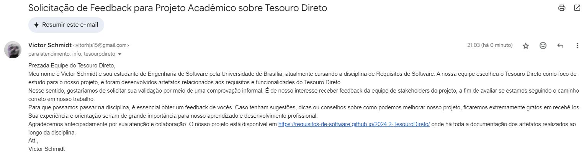
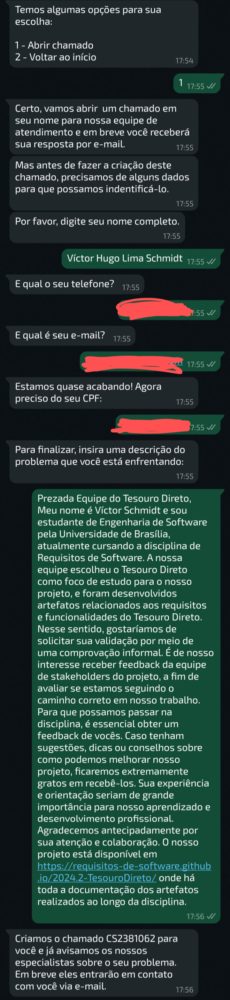

# Comprovação Informal

## Introdução

Ao atingir a etapa de confirmação do alinhamento da solução com as expectativas do público-alvo <a id="REF1" href="#anchor_1">1</a>, optou-se por aplicar um método de verificação simplificado. Essa abordagem utiliza descrições em linguagem acessível para facilitar a detecção de inconsistências na formulação das necessidades técnicas <a id="REF1" href="#anchor_1">1</a>. Para o contexto específico da instituição financeira em questão, a estratégia priorizada foi estabelecer comunicação direta com seus representantes, visando assegurar a precisão das análises realizadas.

## Método de comunicação

Para garantir a confirmação das análises realizadas, foram utilizados diversos canais de comunicação. O e-mail foi selecionado como o método principal para enviar as informações, enquanto o WhatsApp serviu como um recurso complementar para tratar do tema.

Vale ressaltar que, considerando a formalidade do tópico abordado, as comunicações via e-mail e WhatsApp foram elaboradas com um tom mais organizado e profissional. A decisão por esse formato foi baseada na necessidade de compartilhar dados técnicos e minuciosos sobre os materiais desenvolvidos.

Dessa forma, a integração dessas duas formas de comunicação – e-mail e WhatsApp – ofereceu uma estratégia completa e eficiente para atingir o propósito de obter a confirmação necessária. As imagens 1 e 2 ilustram as mensagens enviadas pelos canais mencionados, todas realizadas no dia 26 de janeiro, às 21h.

**Figura 1** - Mensagem por e-mail.

<figure markdown>

Autor: [Víctor Schmidt](https://github.com/moonshinerd)

**Figura 2** - Mensagem pelo WhatsApp.

<figure markdown>

Autor: [Víctor Schmidt](https://github.com/moonshinerd)

## Retorno do Tesouro Direto
Até o momento da entrega do artefato (26/01/2025) não foram obtidas respostas de validação. Caso a equipe entre em contato por alguma rede social, será inserido neste artefato sua comprovação informal quanto ao que foi desenvolvido no projeto.

## Referências Bibliográficas

> <a id="anchor_1" href="#REF1">1.</a> SERRANO, Milene. Requisitos - Aula 23. 2017. Apresentação de slides.

## Histórico de Versões

| Versão | Data | Descrição | Autor(es) | Revisor(es) |
| --- | --- | --- | --- | --- |
| 1.0 | 26/01/2025 | Criação da documentação e Adição das mensagens | [Víctor Schmidt](https://github.com/moonshinerd) |  [Thales Euflauzino](https://github.com/thaleseuflauzino) |
